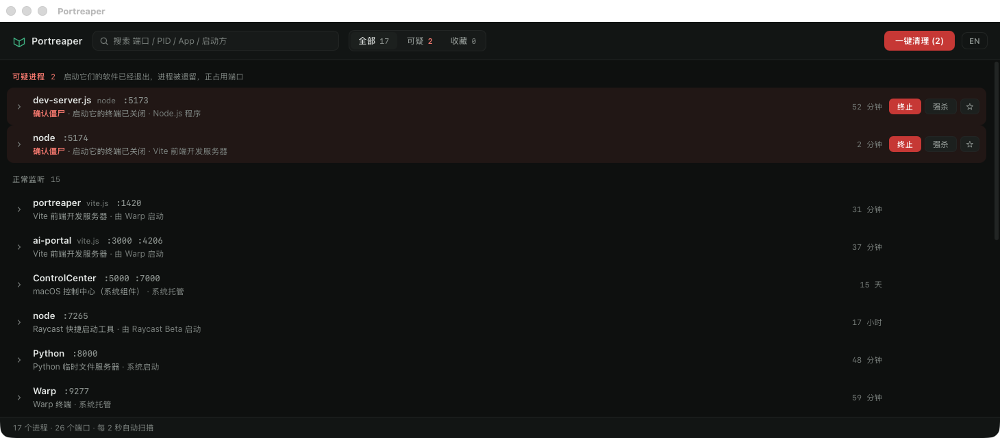

[English](#english) | [中文](#中文)

---

## English

# Portreaper

**A macOS/Windows menubar app that hunts down orphaned dev-server "zombies" holding your ports hostage.**

[](https://github.com/fanhefeng/portreaper/actions/workflows/ci.yml)
[](https://github.com/fanhefeng/portreaper/releases/latest)
[](LICENSE)




### What it does

You kill a terminal, but the `vite` / `node` / `cargo run` it launched keeps running — reparented to the OS, still squatting on port 3000. Next time you `npm run dev` the port is "already in use" and you have no idea which ghost to `kill`.

Portreaper is **not** a generic port viewer. It lives in your tray, scans every couple of seconds, and its core job is to **classify which listeners are orphaned dev-server zombies** so you can reap them with one click.

For every TCP-listening process it shows the ports, a human-readable app label, the executable path, the **launcher chain** (e.g. "this Node process was started by iTerm, whose parent is gone"), PID/PPID, uptime, CPU and memory. Suspected zombies are flagged with the exact signals that triggered the suspicion, sorted to the top, and counted in the tray. A **batch sweep** terminates the high-confidence ones in one action, and a **whitelist (收藏)** permanently exempts anything you trust.

### Download

Get it from the **[website](https://fanhefeng.github.io/portreaper/)** or **[GitHub Releases](https://github.com/fanhefeng/portreaper/releases/latest)**.

Stable direct links (always point at the latest release):

| Platform | Download |
| --- | --- |
| macOS (Apple Silicon) | [Portreaper-macos-arm64.dmg](https://github.com/fanhefeng/portreaper/releases/latest/download/Portreaper-macos-arm64.dmg) |
| macOS (Intel) | [Portreaper-macos-x64.dmg](https://github.com/fanhefeng/portreaper/releases/latest/download/Portreaper-macos-x64.dmg) |
| Windows (x64) | [Portreaper-windows-x64-setup.exe](https://github.com/fanhefeng/portreaper/releases/latest/download/Portreaper-windows-x64-setup.exe) |

> **Windows is experimental.** The Windows build is compiled and unit-tested in CI but has not yet had manual QA on a real machine. Expect rough edges. See [docs/TESTING-WINDOWS.md](docs/TESTING-WINDOWS.md).

#### Opening an unsigned build

Releases are **not code-signed yet**, so the OS will warn you. This is expected.

**macOS (Gatekeeper).** Drag Portreaper into `/Applications` **first** and launch it from there — running it straight from the mounted `.dmg` triggers App Translocation (the app runs from a random read-only path) and the steps below won't stick. Then:

1. Try to open it once (it gets blocked).
2. Open **System Settings → Privacy & Security**, scroll down, and click **"Open Anyway"** next to the Portreaper notice.

Alternatives if that does not appear:

- Right-click the app → **Open** → confirm in the dialog, or
- Right-click the bundled **`解除隔离 Remove Quarantine.command`** in the dmg window → **Open** (shipped since v0.7.1) — strips quarantine and launches the app automatically (the script is quarantined too, hence right-click rather than double-click), or
- Strip the quarantine flag from a terminal:
  ```bash
  xattr -dr com.apple.quarantine /Applications/Portreaper.app
  ```

> **If macOS says Portreaper "is damaged and can't be opened"** (instead of the developer-verification notice), "Open Anyway" and right-click → Open usually won't help — this is the unsigned-app variant, and the bundled `.command` helper or the `xattr` command above are the reliable fixes.

**Windows (SmartScreen).** Run the installer; on the blue "Windows protected your PC" screen click **More info → Run anyway**. Because Portreaper terminates other processes, some antivirus / EDR products may flag it — allow it if you trust the source.

### How detection works

A process is judged by **signals** (reasons it looks orphaned), **exemptions** (reasons it's legitimately long-lived), and a resulting **confidence tier**.

| Signals (suspect) | Exemptions (never suspect) |
| --- | --- |
| Direct orphan — macOS `PPID=1`; Windows parent exited / PID slot reused | Managed by `launchd` / `launchctl` |
| Orphaned launcher chain — dead shell → live dev server | Homebrew service paths |
| Orphaned TTY session | Standard install paths (`/Applications`, `Program Files`, ...) |
| Defunct (`Z` / zombie state) | Managed by `pm2` |
| Dev-server keyword (`vite`, `node`, `cargo run`, ...) — extra reason, not required | |
| **Port-less dev orphan** — a dev process holding *no* port (e.g. an orphaned `electron-vite` Electron main) is still surfaced, with a "no port" badge | |
| **Duplicate dev server** — two instances of the same project (same command / same cwd + script identity); shown as `Possible`, never swept | |

Processes started (or reparented) less than 10 seconds ago are **downgraded to Possible** — still flagged with a reason chip, but never swept.

| Confidence | Meaning | In batch sweep? |
| --- | --- | --- |
| **Confirmed** | Defunct, or an orphan corroborated by a second signal — dev-server traits (or an automation session), or a dead terminal session | ✅ |
| **Likely** | Orphaned, but with no dev evidence to explain the intent (e.g. a `nohup`-detached non-dev binary) | ✅ |
| **Possible** | One weaker signal; shown but treated cautiously | ❌ |

The **one-click sweep** only kills `confirmed` + `likely`. Anything in the whitelist is exempt from suspicion, the tray count, and the sweep — it still appears in the list with a ★ chip.

> **Known limitation:** a dev server you *intentionally* detached (`nohup ... &` then closing the shell) is behaviorally identical to an accidental zombie and will be flagged. If you run such daemons on purpose, ★ star them once — the whitelist permanently exempts them. Daemons managed by `launchd`, `brew services` or `pm2` are already exempted automatically.

The app is **bilingual** (中文 / English) and follows your system language by default, with a manual toggle.

### Development

Prerequisites: **Rust** (stable), **Node.js**, and **pnpm**.

```bash
pnpm install        # first-time setup
pnpm tauri dev      # run the desktop app (vite on :1430 + tauri webview)
pnpm tauri build    # produce the bundle (.app / .dmg / .exe)
```

Rust-only iteration and tests:

```bash
# Run from the repo root — it is the Cargo workspace root. A bare `cargo test`
# inside src-tauri/ silently skips crates/portreaper-core, i.e. the engine that
# owns every classification test.
cargo check --workspace
cargo test --workspace    # detection / classification unit tests
```

Releases are cut by pushing a version tag — see [docs/RELEASING.md](docs/RELEASING.md).

### Project structure

```
src/                  React 19 + TS UI — App.tsx (container: polls scan, kill/whitelist flows)
                      + components/ (row, detail panel, section, confirm modal)
crates/portreaper-core/src/   the engine — no GUI dependency, reusable by other frontends
  scanner/            process scan + v2 zombie classification (the core logic)
                      mod / model / classify / identify / macos / windows
  platform.rs         cross-platform kill with PID-reuse identity check
  whitelist.rs        JSON-persisted whitelist (收藏)
crates/portreaper-cli/  CLI frontend (scan / kill / whitelist)
src-tauri/src/        desktop shell only — no verdict logic
  lib.rs              tray, window lifecycle, invoke handlers
  commands.rs         Tauri command surface (thin wrappers over the engine)
  paths.rs            per-environment directory resolution (dev / prod isolation)
integrations/raycast/   Raycast extension frontend
scripts/              release tooling (bump-version) + CI guards (reason parity, asset-name parity)
.github/workflows/    CI + release pipelines
website/              GitHub Pages download site
docs/                 maintainer & QA docs
```

### Where it stores data

Portreaper writes only two things: the **whitelist** (your starred "leave it alone" entries) and a rotating **log file**. Base locations come from Tauri's per-app directories (all suffixed with the bundle identifier `com.fhf.portreaper`).

**Dev builds are fully isolated from the installed app.** A `pnpm tauri dev` run (debug build) nests everything under a `dev/` subdirectory and writes `portreaper-dev.log`; the installed release uses the base directory and `portreaper-prod.log`. So whitelist entries and error logs from local testing never leak into your day-to-day data, and vice versa. (This is decided at compile time via `cfg(debug_assertions)` — no env var needed; see `src-tauri/src/paths.rs`.)

| Platform | What | Release (prod) | Dev (`pnpm tauri dev`) |
|----------|------|----------------|------------------------|
| **macOS** | Whitelist | `~/Library/Application Support/com.fhf.portreaper/whitelist.json` | `~/Library/Application Support/com.fhf.portreaper/dev/whitelist.json` |
| | Logs | `~/Library/Logs/com.fhf.portreaper/portreaper-prod.log` | `~/Library/Logs/com.fhf.portreaper/dev/portreaper-dev.log` |
| **Windows** | Whitelist | `%APPDATA%\com.fhf.portreaper\whitelist.json` | `%APPDATA%\com.fhf.portreaper\dev\whitelist.json` |
| | Logs | `%LOCALAPPDATA%\com.fhf.portreaper\logs\portreaper-prod.log` | `%LOCALAPPDATA%\com.fhf.portreaper\logs\dev\portreaper-dev.log` |

Notes:

- **Whitelist** is written atomically (temp file + rename); you may transiently see `whitelist.json.tmp`, and a `whitelist.json.corrupt` backup if the file ever fails to parse.
- **Logs** rotate at 1 MiB and keep only one file (a persistent failure can't fill the disk). Debug builds also log to stdout.
- **Webview data** (the `localStorage` language preference, WKWebView/WebView2 caches) is managed by the OS/framework, not by Portreaper. It is isolated by origin (`tauri://localhost` for the release vs `localhost:1430` for dev). On Windows the WebView2 runtime keeps its own `EBWebView\` folder under the config directory above.

Uninstalling does not remove these directories — delete the `com.fhf.portreaper` folders above by hand if you want a clean wipe.

### License

MIT © fhf. See [LICENSE](LICENSE).

---

## 中文

# Portreaper

**一个 macOS / Windows 菜单栏小工具，专门揪出占着端口不放的「僵尸」开发服务器进程。**

[](https://github.com/fanhefeng/portreaper/actions/workflows/ci.yml)
[](https://github.com/fanhefeng/portreaper/releases/latest)
[](LICENSE)


### 它能做什么

你关掉了终端，但它启动的 `vite` / `node` / `cargo run` 还在跑 —— 被系统「收养」成了孤儿进程，继续占着 3000 端口。下次 `npm run dev` 提示「端口已被占用」，你却根本不知道该 `kill` 哪个鬼。

Portreaper **不是**通用的端口查看器。它常驻托盘，每隔两秒扫描一次，核心能力是**判断哪些监听进程是孤儿化的僵尸开发服务器**，让你一键收割。

对每个正在 TCP LISTEN 的进程，它会展示端口、人类可读的应用名、可执行文件路径、**启动链**（例如「这个 Node 是 iTerm 启动的，但它的父进程已经没了」）、PID/PPID、运行时长、CPU 和内存。疑似僵尸会标注出触发判断的具体信号、排到列表顶部、并计入托盘数字。**一键清扫**可一次性终止高置信度的那些，**收藏（白名单）**则可永久豁免你信任的进程。

### 下载

从**[官网](https://fanhefeng.github.io/portreaper/)**或 **[GitHub Releases](https://github.com/fanhefeng/portreaper/releases/latest)** 获取。

稳定直链（始终指向最新版本）：

| 平台 | 下载 |
| --- | --- |
| macOS（Apple 芯片） | [Portreaper-macos-arm64.dmg](https://github.com/fanhefeng/portreaper/releases/latest/download/Portreaper-macos-arm64.dmg) |
| macOS（Intel） | [Portreaper-macos-x64.dmg](https://github.com/fanhefeng/portreaper/releases/latest/download/Portreaper-macos-x64.dmg) |
| Windows（x64） | [Portreaper-windows-x64-setup.exe](https://github.com/fanhefeng/portreaper/releases/latest/download/Portreaper-windows-x64-setup.exe) |

> **Windows 为实验性版本。** Windows 构建仅在 CI 中编译并跑过单元测试，尚未在真机上做过人工验收，可能有不少粗糙的地方。详见 [docs/TESTING-WINDOWS.md](docs/TESTING-WINDOWS.md)。

#### 打开未签名的版本

发布包**目前尚未做代码签名**，系统会弹出警告，这是正常现象。

**macOS（Gatekeeper）。** 请**先**把 Portreaper 拖进「应用程序」(`/Applications`) 再打开 —— 不要直接在挂载的 `.dmg` 里双击运行，那会触发 App Translocation（系统把 App 拷到随机只读路径执行），导致下面的步骤全部失效。然后：

1. 先双击打开一次（会被拦截）。
2. 打开「**系统设置 → 隐私与安全性**」，向下滚动，在 Portreaper 的提示旁点击「**仍要打开**」。

如果上面那个按钮没出现，可改用：

- 右键点击 App →「**打开**」→ 在弹窗里确认；或
- 右键 dmg 窗口里随附的「**解除隔离 Remove Quarantine.command**」→「**打开**」（v0.7.1 起附带）—— 自动移除隔离并启动应用（脚本自身也带隔离标记，所以要右键而不是双击）；或
- 在终端里去掉隔离属性：
  ```bash
  xattr -dr com.apple.quarantine /Applications/Portreaper.app
  ```

> **如果系统提示的是「已损坏，无法打开」**（而不是「无法验证开发者」），「仍要打开」和右键打开通常都没用 —— 这是未签名 App 的另一种报错，dmg 里随附的解除隔离脚本或上面的 `xattr` 命令才是可靠解法。

**Windows（SmartScreen）。** 运行安装程序，在蓝色的「Windows 已保护你的电脑」界面点击「**更多信息 → 仍要运行**」。由于 Portreaper 会终止其他进程，部分杀毒 / EDR 软件可能将其标记为可疑 —— 若你信任来源，请放行。

### 检测原理

判定一个进程时，会综合**信号**（看起来像孤儿的理由）、**豁免**（合理地长期存活的理由），最终得出一个**置信度等级**。

| 信号（疑似） | 豁免（永不判为僵尸） |
| --- | --- |
| 直接孤儿 —— macOS `PPID=1`；Windows 父进程已退出 / PID 槽位被复用 | 由 `launchd` / `launchctl` 托管 |
| 启动链断裂 —— 已死的 shell → 仍存活的开发服务器 | Homebrew 服务路径 |
| 孤儿 TTY 会话 | 标准安装路径（`/Applications`、`Program Files` 等） |
| 已死（`Z` / defunct 状态） | 由 `pm2` 托管 |
| 命中 dev-server 关键字（`vite`、`node`、`cargo run` 等）—— 额外理由，非必需 | |
| **无端口的 dev 孤儿** —— 不占任何端口的孤儿 dev 进程（如 electron-vite 残留的 Electron 主进程）也会被检出，并带「无端口」徽标 | |
| **同项目重复 dev server** —— 同一项目的两个实例（命令相同 / cwd + 脚本身份相同）；只标为「可能」，永不清扫 | |

启动（或被收养）不足 10 秒的进程会被**降级为「可能」**——仍会标注原因，但永远不会进入清扫。

| 置信度 | 含义 | 计入一键清扫？ |
| --- | --- | --- |
| **确认（confirmed）** | 已 defunct，或孤儿信号有第二条证据互证 —— 开发服务器特征（或自动化会话），或终端会话已死 | ✅ |
| **疑似（likely）** | 已成孤儿，但没有 dev 证据可以解释它的意图（如 `nohup` 脱离的非 dev 二进制） | ✅ |
| **可能（possible）** | 仅一个较弱的信号；会显示但谨慎对待 | ❌ |

**一键清扫**只会终止 `confirmed` + `likely`。收藏（白名单）中的进程会被豁免于疑似判断、托盘计数和清扫 —— 它仍会出现在列表中，并带一个 ★ 标记。

> **已知限制**：你*有意*脱离终端的 dev server（`nohup ... &` 后关掉 shell）与意外产生的僵尸在行为上无法区分，会被标记。如果你确实需要这样跑守护进程，给它点一次 ★ 收藏即可永久豁免；由 `launchd`、`brew services` 或 `pm2` 托管的守护会被自动豁免。

### 终止是「真的死了」，不是「信号发出去了」

`kill(2)` 返回成功只代表信号已投递。Portreaper 在发出信号后会持续复查目标是否真的
消失（约 2.5 秒上限），没死就如实告诉你，并就地给出强制终止的入口 —— 而不是打一个
绿勾了事。

一个专门覆盖的场景：**被 Ctrl-Z 挂起的 dev server**（或后台作业读写终端而被停住的
进程）根本不会去处理已被它捕获的终止信号 —— 信号一直挂着，而系统照样报告成功。
Portreaper 会把这类行标出「已暂停」，并在温和终止后唤醒它，让它自己收尾。

应用为**中英双语**，默认跟随系统语言，也可手动切换。

### 开发

前置依赖：**Rust**（stable）、**Node.js**、**pnpm**。

```bash
pnpm install        # 首次安装
pnpm tauri dev      # 运行桌面应用（vite 跑在 :1430 + tauri webview）
pnpm tauri build    # 产出安装包（.app / .dmg / .exe）
```

仅 Rust 的迭代与测试：

```bash
# 在仓库根执行 —— 它才是 Cargo workspace 根。在 src-tauri/ 里裸跑 cargo test
# 会静默跳过 crates/portreaper-core，也就是跳过全部分类逻辑的测试。
cargo check --workspace
cargo test --workspace    # 检测 / 分类逻辑的单元测试
```

发布通过推送版本 tag 触发 —— 详见 [docs/RELEASING.md](docs/RELEASING.md)。

### 项目结构

```
src/                  React 19 + TS UI —— App.tsx（容器：轮询扫描、kill / 收藏流程）
                      + components/（行、详情面板、分区、确认弹窗）
crates/portreaper-core/src/
  scanner/            进程扫描 + v2 僵尸分类（判定引擎，零 GUI 依赖）
                      mod / model / classify / identify / macos / windows
  platform.rs         跨平台 kill，带 PID 复用身份校验
  whitelist.rs        JSON 持久化的收藏（白名单）
crates/portreaper-cli/  命令行前端（scan / kill / whitelist）
src-tauri/src/
  lib.rs              托盘、窗口生命周期、invoke 处理器
  commands.rs         Tauri 命令入口（引擎的薄封装）
  paths.rs            分环境目录解析（dev / prod 隔离）
integrations/raycast/   Raycast 扩展前端
scripts/              发布工具（版本号 bump）+ CI 守卫（reason parity / 资产名一致性）
.github/workflows/    CI 与发布流水线
website/              GitHub Pages 下载站
docs/                 维护者与 QA 文档
```

### 应用产生的文件与目录

Portreaper 只往磁盘写两样东西：**收藏（白名单）**（你标星的「别动它」条目）和一份会轮转的**日志文件**。基目录取自 Tauri 的分应用目录（均以 bundle identifier `com.fhf.portreaper` 结尾）。

**开发版与正式版的数据彻底隔离。** `pnpm tauri dev`（debug 构建）会把所有数据塞进 `dev/` 子目录、日志写成 `portreaper-dev.log`；安装的正式版（release）直接用基目录、日志为 `portreaper-prod.log`。于是本地随手测试加的收藏、刷出的报错日志，绝不会混进日常使用的正式版数据里（反之亦然）。（这一隔离在编译期由 `cfg(debug_assertions)` 决定，无需任何环境变量，详见 `src-tauri/src/paths.rs`。）

| 系统 | 内容 | 正式版（prod） | 开发版（`pnpm tauri dev`） |
|------|------|----------------|----------------------------|
| **macOS** | 收藏 | `~/Library/Application Support/com.fhf.portreaper/whitelist.json` | `~/Library/Application Support/com.fhf.portreaper/dev/whitelist.json` |
| | 日志 | `~/Library/Logs/com.fhf.portreaper/portreaper-prod.log` | `~/Library/Logs/com.fhf.portreaper/dev/portreaper-dev.log` |
| **Windows** | 收藏 | `%APPDATA%\com.fhf.portreaper\whitelist.json` | `%APPDATA%\com.fhf.portreaper\dev\whitelist.json` |
| | 日志 | `%LOCALAPPDATA%\com.fhf.portreaper\logs\portreaper-prod.log` | `%LOCALAPPDATA%\com.fhf.portreaper\logs\dev\portreaper-dev.log` |

说明：

- **收藏**采用原子写（临时文件 + rename）：你可能会瞬间看到 `whitelist.json.tmp`；若文件解析失败，损坏的旧文件会被备份为 `whitelist.json.corrupt`。
- **日志**到 1 MiB 即轮转、只保留一份（持续性故障也刷不满磁盘）。debug 构建额外打到 stdout。
- **webview 数据**（语言偏好等 `localStorage`、WKWebView/WebView2 缓存）由系统/框架管理，并非 Portreaper 自建。它按 origin 天然隔离（正式版 `tauri://localhost`、开发版 `localhost:1430`）。Windows 上 WebView2 运行时会在上述配置目录下另建一个 `EBWebView\` 文件夹。

卸载应用不会删除这些目录 —— 若想彻底清干净，请手动删除上面的 `com.fhf.portreaper` 目录。

### 许可证

MIT © fhf。详见 [LICENSE](LICENSE)。
